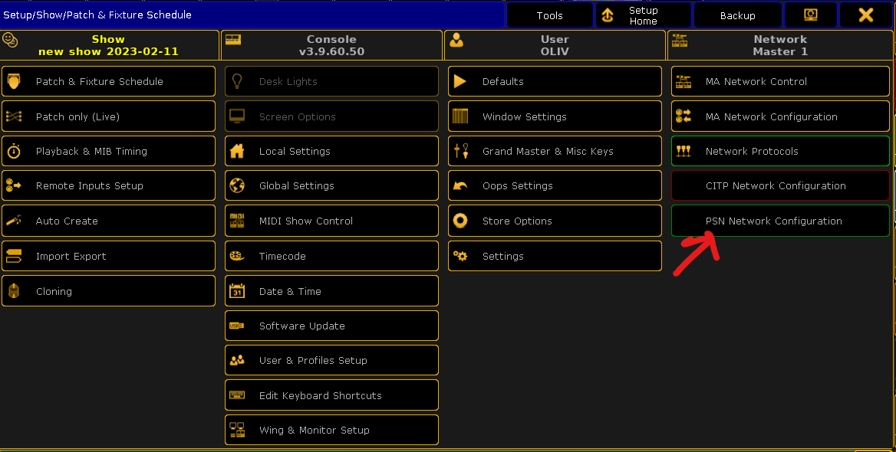

# Auto Zoom grandma2 plugin 

This is a plugin for [grandma2](https://www.malighting.com/) to automatically control the zoom of a moving head to that the beam size will be constant on a moving stage marker.

## 📦️ Installation

1. Download the file `auto-zoom.lua` and `auto-zoom.xml` and put them in the `plugins` folder of grandma2

  - usually `C:\Program Files (x86)\grandma2\pluginsC:\ProgramData\MA Lighting Technologies\grandma\gma2_V_3.9.60\plugins` on windows.
  - In your usb key `gma2/plugins`.

2. Load the plugin in your show file.

  - Open the plugin pool (Create Basic Window -> System -> Plugin)
    
  - Right click where you want to add the plugin.
    
  - An Edit Plugin window will show up.
    
  - You can optionally select `Execute On Load` so that the plugin automatically starts when you load the show file.
    

3. Next we want to create a couple of macro to control the execution of the plugin.

  - `LUA "AZ.Enable()"`. This will enable the plugin and make it run.
  - `LUA "AZ.Disable()"`. This will disable the plugin and stop it from running.
  - `LUA "AZ.ShowEnabled()"`. This will show a message in the console if the plugin is enabled or not.
  - `LUA "AZ.SetMode('Programmer')"`. This will set the plugin to `Programmer` mode.
  - `LUA "AZ.SetMode('Executor')"`. This will set the plugin to `Executor` mode.
  - `LUA "AZ.ShowMode()"`. This will show a message in the console if the plugin is in `Programmer` or `Executor` mode.
  - `LUA "AZ.Refresh()"`. This will refresh the plugin. This is useful if you change fixture type properties or fixture info.

## 🚀 Usage

### Enable/Disable

To enable the plugin, run the macro containing `LUA "AZ.Enable()"`. To disable the plugin, run the macro containing `LUA "AZ.Disable()"`.
This can also be controlled with user variable `AUTO_ZOOM_PLUGIN_ENABLED` (0 = disabled, 1 = enabled).
If `Execute On Load` is enabled, the plugin will automatically start when you load the show file.

### Prepare fixture

1. Import the fixture type in your show file you want to use, then enable XYZ mode with `Enable XYZ` button.
     

2. Then edit the fixture type with the `Edit` button.
     

3. Next edit Pan and with `Edit Row` button.
     

4. Make sure From/To and FromPhys/ToPhys are set to value matching your fixture. You would be surprise how much fixture are wrong.
     
       For example with the Arolla Profile MP the website give that pan is 540°. Which divided by 2 gives 270°.
       

5. Do the same for the tilt value.

6. Next jump to the zoom channel and set From/To to 0 -> 100. And FromPhys/ToPhys to value from the manufacturer website.
     
       For example with Arolla Profile MP:
       

7. If you use iris to create a smaller beam when zoom if not enough, do the same for the iris.
     

That is all that is required, all this steps can be repeated if you have multiple fixture type that you need to use for XYZ tracking.

### Prepare stage marker

Stage marker is a virtual fixture, with XYZ position that can move. A fixture can follow a marker. More [Use Stage Markers](https://help2.malighting.com/Page/grandMA2/xyz_use_stage_markers/en/3.3).

> It is important for stage marker to be patched with a dmx address, otherwise they won't move.

Next you need to assign a PSN tracker to your stage marker. More can be found in [PosiStageNet](https://help2.malighting.com/Page/grandMA2/network_psn/en/3.3). The menu can be accessed with Setup -> Network -> Psn Network Configuration.

In this menu you need to enable it with `Enabled` button.

Then click on `Add` button and right click on the `Enabled` cell to turn it to `Yes`.

Kratos server should show up, you can navigate into it with `View Tracker` button.

Can can view every target coming from Kratos, and assign them to your stage marker of choice by clicking in `Fixture ID` cell.

Now when a target moves in Kratos, you should see the stage marker move:

### Programmer mode

Programmer mode is the easiest mode to use as it doesn't require any programming. You should only use this mode for testing purpose, it can be a good idea to test your setup before using executor mode.

- Call your macro with `LUA "AZ.SetMode('Programmer')" ` to enable this mode
- Call in a plugin `LUA "AZ.EnableFixture(<fixture>, <stage marker>, <beam size>)"`. For example `LUA "AZ.EnableFixture(1, 1001, 2)"` will enable XYZ tracking for `Fixture 1` on stage marker `Fixture 1001` with a beam size of 2m.
  - `<fixture>` can be the ID of the fixture or the label
  - `<stage marker>` can be the ID of the fixture or the label
  - `<beam size>` is the value of the beam in meters
- You can disable fixture tracking with `LUA "AZ.DisableFixture(<fixture>)"`

### Executor mode

Once you made sure you that everything work, you can move to executor mode which have additional requirement.

* Call your macro with `LUA "AZ.SetMode('Executor')" ` to enable this mode
* You can still enable/disable fixture like in Programmer mode.

You will need to create 2 sequences per fixture, assigned on fader. The label of the sequence are important.

* `XYZ_ZOOM_<fixture id>`: A sequence with Temp fader with zoom wide stored. If you fixture id is 1, then sequence name is `XYZ_ZOOM_1`.
* `XYZ_IRIS_<fixture id>`: A sequence with Temp fader with iris open stored. If you fixture id is 1, then sequence name is `XYZ_IRIS_1`.

Then for each pair fixture/marker you need to create a base sequence `XYZ_<fixture id>_<stage marker id>` with:

* STAGEX at 0
* STAGEY at 0
* STAGEZ at 0 (or the offset you need)
* MARK to the stage marker
* ZOOM narrow
* IRIS close (or the minimum iris you want to use).

For example for fixture 1 and stage marker 1001, the sequence will be named `XYZ_1_1001`.

The plugin will then call the appropriate base sequence when you `LUA "AZ.EnableFixture(fixture, marker, beam size)"` and control zoom and iris temp fader to make the beam size matching your desired value.

## 📄 License

MIT License, see [LICENSE](LICENSE) for more information.
